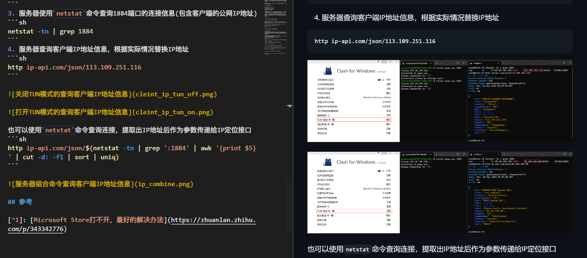
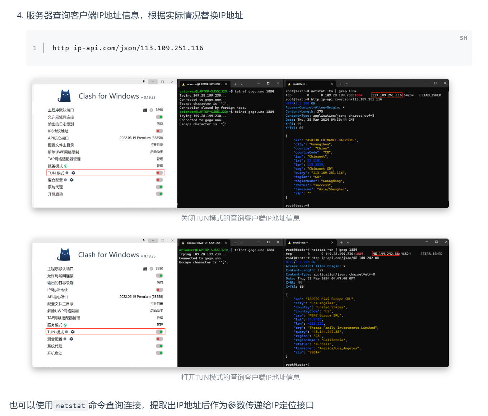

# 个人博客说明


## 快速开始
### 部署命令
### 问题处理

## 特性


## 推送失败问题
如果遇到无法推送的问题
```sh
! [remote rejected] main -> main (refusing to allow an OAuth App to create or update workflow `.github/workflows/ci.yml` without `workflow` scope)
error: failed to push some refs to 'https://github.com/Orionxer/blog'
```
尝试Github Cli触发浏览器鉴权，Windows安装命令
```sh
winget install --id GitHub.cli
```

工程根目录下，执行该命令

```sh
gh auth login
```
根据提示一步步验证，直至该命令提示`Logged in as Orionxer`

```sh
? Where do you use GitHub? GitHub.com
? What is your preferred protocol for Git operations on this host? HTTPS
? Authenticate Git with your GitHub credentials? Yes
? How would you like to authenticate GitHub CLI? Login with a web browser

! First copy your one-time code: FBFE-2BE0
Press Enter to open https://github.com/login/device in your browser... 
✓ Authentication complete.
- gh config set -h github.com git_protocol https
✓ Configured git protocol
✓ Logged in as Orionxer
```

## 本地部署命令
需要确保本地hexo已经安装成功
```sh
git clone https://github.com/Orionxer/blog
cd blog
rm -rf node_modules && npm install --force
hexo clean && hexo g && hexo s
# 自定义域名配置
hexo g --config gogo_config.yml
```

### 图片路径不一致问题
```sh
# 删除hexo-asset-image和hexo-img-locator,否则hexo可能渲染失败
npm uninstall hexo-asset-image --save
npm uninstall hexo-img-locator --save
```
VSCode安装[Hexo Utils](https://marketplace.visualstudio.com/items?itemName=fantasy.vscode-hexo-utils)插件，可以解决本地图片路径与Hexo部署路径不一致的问题

VSCode本地预览效果


Hexo部署效果



快捷键`Ctrl + Alt + v`可以快速粘贴图片至同名文件夹，参考[Preview Image in Both VSCode And Hexo](https://jtr109.com/2024/03/23/Preview-Image-in-Both-VSCode-And-Hexo/)

确保`_config.yml`打开此项
```sh
post_asset_folder: true
```

## 双向链接
```sh
npm install hexo-backlink
# 在_config.yml添加
backlink: true
```
双向连接使用方式：`[[title]]`，搭配VSCode插件`Foam`能够完成知识图谱构建

## VSCode本地预览折叠块
VSCode Markdown本地渲染折叠块：暂时没有找到可行的办法。考虑做一个VSCode插件，参考插件`Markdown Collapsible`

## TODO 列表
- [x] 新建scaffolds模板, 比如`hexo new english "25-01-english"`
- [ ] 优化scaffolds模板，`todo.md`和`english.md`
- [ ] vscode markdown 预览gif
- [x] 文章设置可见列表
- [x] 双向链接
- [ ] 优化双向链接在待办页面的显示效果
- [ ] 分类文章，合理分配目录
- [ ] 重新整理readme
- [ ] readme中增加foam的说明以及演示
- [ ] 优化Foam知识图谱颜色
- [ ] 等待所有特性迁移成功，弃用mkdocs-material并删除对应仓库
  


## 仓库体积问题

如果文章中包含了较多图片，存在几个问题

- [ ] 图片在没有压缩的情况下，体积较大，占用空间且访问速度慢
- [ ] Github推荐仓库大小不要超过1GB，当前仓库容量占用 
- [ ] 使用外部图床，则存以下等诸多问题：
  - 易用性：是否易于管理多张图片以及生成图片链接
  - 可用性：是否被墙，或者未来被墙
  - 稳定性：服务商跑路可能性，或者泄露隐私

使用[PicX](https://picx.xpoet.cn)工具实现图片管理，其本质上的存储空间是Github仓库。好处是内置了图片压缩功能(压缩率50%左右)，且能快速优雅地管理图片以及生成图片链接。其限制是依赖于Github网络环境是否稳定，本地图片路径与云端图片路径缺少方便的批量转换的方式。需要编写一个脚本，在部署时将云端图片的路径正确替换本地的图片路径，则能够有效降低对Github Pages的占用（但Github仓库容量大小不变）

## 参考
[^1] : [Hexo-Backlink](https://github.com/Cyrusky/hexo-backlink)

